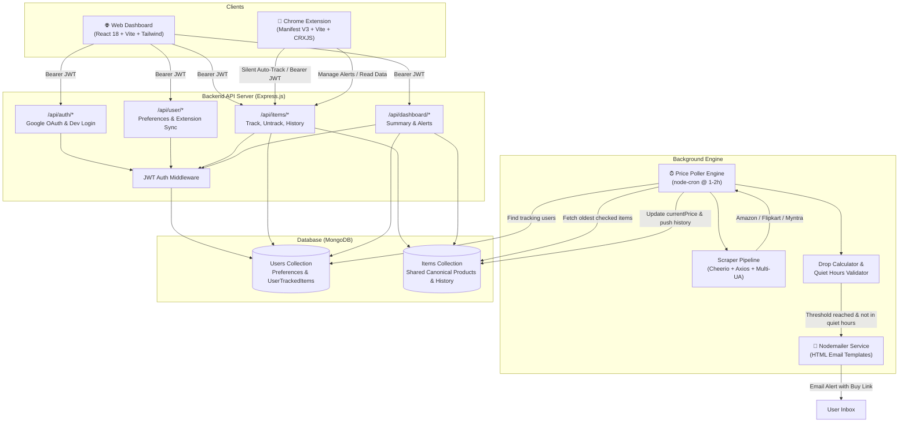
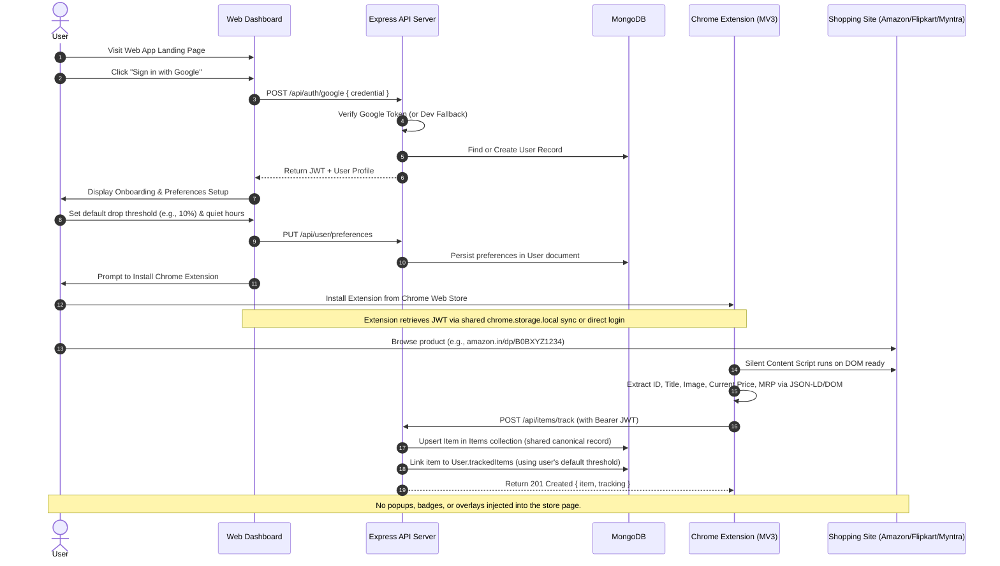
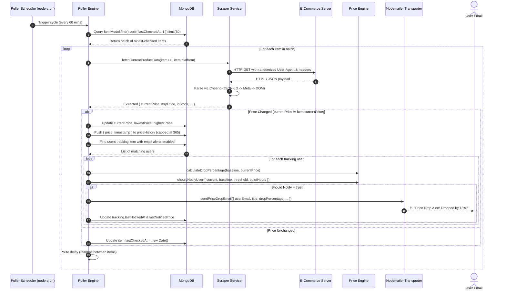
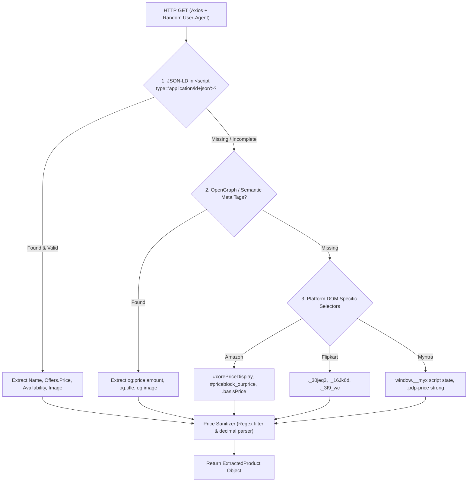

# Multi-Platform E-Commerce Price Tracker — Design Document & Architecture Specification

**Project Name:** Price Ghost (`@price-tracker`)  
**Version:** 1.0.0  
**Last Updated:** September 3, 2026  
**Target Platforms:** Amazon India (`amazon.in`), Flipkart (`flipkart.com`), Myntra (`myntra.com`)  
**Repository Type:** Monorepo (`shared/`, `server/`, `extension/`, `website/`)  

---

## 1. Executive Summary & System Overview

**Price Ghost** is an end-to-end, automated price tracking platform designed for Indian e-commerce ecosystems (Amazon, Flipkart, and Myntra). The architecture decouples the user-facing discovery and tracking trigger from the server-side monitoring engine:

1. **Chrome Extension (Manifest V3)**: Operates completely silently in the background on e-commerce product pages. When a user browses a supported product, the extension automatically extracts product metadata (Platform, External ID, Current Price, MRP, Title, Image) and registers it with the user's tracking list with zero disruptive in-page UI. The extension toolbar popup serves as the primary fast-management interface.
2. **Backend Server (Node.js + Express + MongoDB)**: Acts as the central intelligence hub. It manages user accounts, token authentication (Google OAuth 2.0 & JWT), preference settings, and canonical product storage. An autonomous cron-based polling engine rotates through tracked products, re-scrapes live prices, maintains historical logs, and evaluates price drops against user-configured threshold percentages.
3. **Email Notification Engine (Nodemailer / SMTP)**: When an item drops below a user's defined drop threshold, a responsive, branded price drop alert email is dispatched with direct buy links and savings metrics.
4. **Website Dashboard (React + Vite + Tailwind CSS)**: Provides a full-featured web portal for authentication, global preference management (default thresholds, notification frequency, quiet hours), comprehensive price analytics with interactive charts, and extension installation onboarding.
5. **Shared Library (`@price-tracker/shared`)**: Houses single-source-of-truth TypeScript interfaces, enums, request/response DTOs, and shared utility contracts across frontend, extension, and backend.



---

## 2. End-to-End User Flow & Data Sequences

### 2.1 User Onboarding & Silent Auto-Tracking



### 2.2 Server-Side Poller & Price Drop Notification Cycle



---

## 3. Technology Stack & Directory Architecture

### 3.1 Technology Matrix

| Module | Core Technologies | Description & Key Libraries |
|:---|:---|:---|
| **Root Workspace** | npm workspaces / scripts | Orchestrates simultaneous development across sub-packages |
| **Shared Library** | TypeScript 5.7 | `@price-tracker/shared`: Common types, interfaces, request/response models |
| **Server** | Node.js (ESM), Express.js 4.21 | RESTful API, JWT auth, Mongoose 8.9 ODM, CORS, dotenv |
| **Background Engine** | `node-cron` 3.0, `nodemailer` 6.9 | Scheduled price poller, price-drop evaluation, HTML email templating |
| **Scraper** | `axios` 1.7, `cheerio` 1.0 | Server-side HTML parsing, JSON-LD extraction, User-Agent rotation |
| **Chrome Extension** | React 18, Vite 5, `@crxjs/vite-plugin` | Manifest V3, TypeScript, Tailwind CSS, Lucide React, Chrome Storage |
| **Web Dashboard** | React 18, Vite 6, Tailwind CSS | React Router 7, Recharts 2.15, Lucide React, Axios |
| **Database** | MongoDB 6.0+ | Hosted locally or via MongoDB Atlas |

---

## 4. Codebase Audit & Implementation Status Matrix

The following matrix documents the exact status of every file and directory across the workspace:

| Path | File / Component | Language / Type | Implementation Status | Description & Key Exports |
|:---|:---|:---|:---|:---|
| `shared/` | `package.json` | JSON | **Complete** | Package manifest for `@price-tracker/shared` |
| `shared/` | `types.ts` | TypeScript | **Complete** | `Platform`, `Item`, `User`, `ExtractedProduct`, `TrackItemRequest`, etc. |
| `server/` | `package.json` | JSON | **Complete** | Dependencies (`express`, `mongoose`, `node-cron`, `nodemailer`, etc.) |
| `server/src/config/` | `env.js` | JavaScript (ESM) | **Complete** | Centralized environment variable parser and fallbacks (`ENV`) |
| `server/src/config/` | `db.js` | JavaScript (ESM) | **Complete** | Mongoose connection handler (`connectDB`) |
| `server/src/middleware/` | `auth.js` | JavaScript (ESM) | **Complete** | `authMiddleware` (enforces Bearer JWT) & `optionalAuthMiddleware` |
| `server/src/models/` | `Item.js` | JavaScript (ESM) | **Complete** | Mongoose schema for canonical items, price history, uniqueKey indexes |
| `server/src/models/` | `User.js` | JavaScript (ESM) | **Complete** | Mongoose schema for users, preferences, and subdocument `trackedItems` |
| `server/src/routes/` | `auth.js` | JavaScript (ESM) | **Complete** | `POST /google`, `POST /dev-login`, `GET /me`, `POST /logout` |
| `server/src/routes/` | `user.js` | JavaScript (ESM) | **Complete** | `GET /preferences`, `PUT /preferences`, `PUT /extension-status` |
| `server/src/routes/` | `items.js` | JavaScript (ESM) | **Complete** | `POST /track`, `DELETE /untrack/:id`, `PUT /:id/threshold`, `GET /tracked`, `GET /:id/history` |
| `server/src/routes/` | `dashboard.js` | JavaScript (ESM) | **Complete** | `GET /summary`, `GET /alerts` |
| `server/src/services/` | `priceEngine.js` | JavaScript (ESM) | **Complete** | `sanitizePriceString`, `calculateDropPercentage`, `shouldNotifyUser`, `isInQuietHours` |
| `server/src/services/` | `emailService.js` | JavaScript (ESM) | **Complete** | Nodemailer setup, `generateEmailHtml`, `sendPriceDropEmail` (with console mock fallback) |
| `server/src/services/` | `poller.js` | JavaScript (ESM) | **Complete** | `runPollerCycle`, `startPollerScheduler`, queue rate limiting, spam prevention |
| `server/src/services/scraper/` | `index.js` | JavaScript (ESM) | **Complete** | Multi-platform dispatcher, User-Agent rotator, Axios HTTP client |
| `server/src/services/scraper/` | `amazon.js` | JavaScript (ESM) | **Complete** | Amazon JSON-LD extractor + multi-tier DOM fallback selectors |
| `server/src/services/scraper/` | `flipkart.js` | JavaScript (ESM) | **Complete** | Flipkart JSON-LD + OpenGraph + custom class fallback selectors |
| `server/src/services/scraper/` | `myntra.js` | JavaScript (ESM) | **Complete** | Myntra `window.__myx` state extractor + JSON-LD + DOM selectors |
| `server/src/` | `app.js` | JavaScript (ESM) | **Complete** | Main Express app entry, middleware stack, route mounting, server listen, health check |
| `extension/` | `package.json` | JSON | **Complete** | Configured with React 18, Vite, CRXJS, Tailwind, Lucide React |
| `extension/src/` | *Extension Source* | TypeScript / React | **Complete** | In-page extractors, manifest.json, background worker, popup UI with search & threshold modal |
| `website/` | `package.json` | JSON | **Complete** | Configured with React 18, Vite 6, Tailwind, Recharts, React Router 7 |
| `website/src/` | *Website Source* | TypeScript / React | **Complete** | Pages (`Landing`, `Login`, `Dashboard`, `Preferences`, `InstallExtension`), AuthContext, Recharts PriceChart |

---

## 5. Complete Database Schema & Data Models (MongoDB)

### 5.1 Items Collection (`items`)

Items represent canonical products shared across all users. If 10,000 users track the exact same Amazon headphones, there is only **one item document** in this collection.

```javascript
import mongoose from 'mongoose';

const PriceHistorySchema = new mongoose.Schema(
  {
    price: { type: Number, required: true },
    timestamp: { type: Date, default: Date.now },
  },
  { _id: false }
);

const ItemSchema = new mongoose.Schema(
  {
    platform: {
      type: String,
      required: true,
      enum: ['amazon', 'flipkart', 'myntra'],
    },
    externalId: { type: String, required: true },
    uniqueKey: { type: String, required: true, unique: true, index: true }, // Format: `${platform}:${externalId}`
    title: { type: String, required: true },
    url: { type: String, required: true },
    imageUrl: { type: String, default: '' },
    currency: { type: String, default: 'INR' },
    currentPrice: { type: Number, required: true },
    mrpPrice: { type: Number, default: 0 },
    lowestPrice: { type: Number, required: true },
    highestPrice: { type: Number, required: true },
    inStock: { type: Boolean, default: true },
    priceHistory: [PriceHistorySchema], // Capped at 365 data points
    trackerCount: { type: Number, default: 1 },
    lastCheckedAt: { type: Date, default: Date.now, index: true },
    lastPriceChangeAt: { type: Date },
  },
  { timestamps: true }
);

// Indexes
ItemSchema.index({ platform: 1, externalId: 1 });
ItemSchema.index({ lastCheckedAt: 1 });
```

### 5.2 Users Collection (`users`)

Stores user account data, alert preferences, and the array of items actively tracked by the user.

```javascript
import mongoose from 'mongoose';

const UserTrackedItemSchema = new mongoose.Schema(
  {
    itemId: { type: mongoose.Schema.Types.ObjectId, ref: 'Item', required: true },
    targetPercentageDrop: { type: Number, required: true, default: 10 },
    baseline: { type: String, enum: ['initial', 'mrp'], default: 'initial' },
    baselinePrice: { type: Number, required: true },
    targetPrice: { type: Number, required: true },
    lastNotifiedAt: { type: Date },
    lastNotifiedPrice: { type: Number },
    createdAt: { type: Date, default: Date.now },
  },
  { _id: false }
);

const UserSchema = new mongoose.Schema(
  {
    googleId: { type: String, required: true, unique: true, index: true },
    email: { type: String, required: true, unique: true, index: true },
    name: { type: String, required: true },
    avatarUrl: { type: String, default: '' },
    notifications: {
      email: { type: Boolean, default: true },
      frequency: {
        type: String,
        enum: ['realtime', '6h', '12h', '24h'],
        default: 'realtime',
      },
      defaultThreshold: { type: Number, default: 10 },
      quietHoursStart: { type: String, default: '' }, // "22:00"
      quietHoursEnd: { type: String, default: '' },   // "08:00"
    },
    trackedItems: [UserTrackedItemSchema],
    extensionInstalled: { type: Boolean, default: false },
  },
  { timestamps: true }
);

// Indexes
UserSchema.index({ 'trackedItems.itemId': 1 });
```

---

## 6. Comprehensive REST API Specification

### 6.1 Authentication Endpoints (`/api/auth`)

#### 1. Exchange Google Token
- **Method:** `POST`
- **Route:** `/api/auth/google`
- **Auth:** Public
- **Request Body:**
  ```json
  { "credential": "GOOGLE_ID_TOKEN_STRING" }
  ```
- **Response (200 OK):**
  ```json
  {
    "token": "eyJhbGciOiJIUzI1NiIsInR5cCI6IkpXVCJ9...",
    "user": {
      "_id": "673f8a00bc91234567890123",
      "email": "user@example.com",
      "name": "Jane Doe",
      "avatarUrl": "https://lh3.googleusercontent.com/...",
      "notifications": {
        "email": true,
        "frequency": "realtime",
        "defaultThreshold": 10
      },
      "extensionInstalled": true
    }
  }
  ```

#### 2. Local Development Login (No OAuth Required)
- **Method:** `POST`
- **Route:** `/api/auth/dev-login`
- **Auth:** Public (Available in development)
- **Request Body:**
  ```json
  { "email": "demo@pricetracker.local", "name": "Demo User" }
  ```
- **Response (200 OK):** Returns JWT token and mock user profile.

#### 3. Current User Profile
- **Method:** `GET`
- **Route:** `/api/auth/me`
- **Auth:** `Bearer <token>`
- **Response (200 OK):** Returns full User document.

#### 4. Logout
- **Method:** `POST`
- **Route:** `/api/auth/logout`
- **Auth:** Public
- **Response (200 OK):** `{ "success": true, "message": "Logged out successfully" }`

---

### 6.2 User Preferences Endpoints (`/api/user`)

#### 1. Get Notification Preferences
- **Method:** `GET`
- **Route:** `/api/user/preferences`
- **Auth:** `Bearer <token>`
- **Response (200 OK):**
  ```json
  {
    "notifications": {
      "email": true,
      "frequency": "realtime",
      "defaultThreshold": 10,
      "quietHoursStart": "23:00",
      "quietHoursEnd": "07:00"
    },
    "extensionInstalled": true
  }
  ```

#### 2. Update Preferences
- **Method:** `PUT`
- **Route:** `/api/user/preferences`
- **Auth:** `Bearer <token>`
- **Request Body:**
  ```json
  {
    "email": true,
    "frequency": "realtime",
    "defaultThreshold": 15,
    "quietHoursStart": "22:00",
    "quietHoursEnd": "08:00"
  }
  ```
- **Response (200 OK):** `{ "success": true, "notifications": { ... } }`

#### 3. Sync Extension Status
- **Method:** `PUT`
- **Route:** `/api/user/extension-status`
- **Auth:** `Bearer <token>`
- **Request Body:** `{ "installed": true }`
- **Response (200 OK):** `{ "success": true, "installed": true }`

---

### 6.3 Item Tracking Endpoints (`/api/items`)

#### 1. Track / Upsert Item
- **Method:** `POST`
- **Route:** `/api/items/track`
- **Auth:** `Bearer <token>`
- **Request Body:**
  ```json
  {
    "platform": "amazon",
    "externalId": "B0BXYZ1234",
    "title": "Sony WH-1000XM5 Wireless Headphones",
    "url": "https://amazon.in/dp/B0BXYZ1234",
    "imageUrl": "https://m.media-amazon.com/images/I/71o8Q5XJS5L._SL1500_.jpg",
    "currentPrice": 27990,
    "mrpPrice": 34990,
    "currency": "INR",
    "targetPercentageDrop": 15,
    "baseline": "initial"
  }
  ```
- **Response (201 Created):**
  ```json
  {
    "success": true,
    "item": {
      "_id": "673f8a00bc91234567890456",
      "uniqueKey": "amazon:B0BXYZ1234",
      "platform": "amazon",
      "externalId": "B0BXYZ1234",
      "title": "Sony WH-1000XM5 Wireless Headphones",
      "currentPrice": 27990,
      "lowestPrice": 27990,
      "highestPrice": 27990,
      "inStock": true,
      "trackerCount": 1
    },
    "tracking": {
      "targetPercentageDrop": 15,
      "baselinePrice": 27990,
      "targetPrice": 23791.5,
      "baseline": "initial"
    }
  }
  ```

#### 2. Get All Tracked Items for Current User
- **Method:** `GET`
- **Route:** `/api/items/tracked`
- **Auth:** `Bearer <token>`
- **Response (200 OK):**
  ```json
  [
    {
      "tracking": {
        "targetPercentageDrop": 15,
        "baseline": "initial",
        "baselinePrice": 27990,
        "targetPrice": 23791.5,
        "lastNotifiedAt": null,
        "createdAt": "2026-09-03T10:00:00.000Z"
      },
      "item": {
        "_id": "673f8a00bc91234567890456",
        "platform": "amazon",
        "externalId": "B0BXYZ1234",
        "title": "Sony WH-1000XM5 Wireless Headphones",
        "url": "https://amazon.in/dp/B0BXYZ1234",
        "imageUrl": "https://m.media-amazon.com/...",
        "currentPrice": 25990,
        "mrpPrice": 34990,
        "lowestPrice": 25990,
        "highestPrice": 27990,
        "inStock": true,
        "priceHistory": [
          { "price": 27990, "timestamp": "2026-09-03T10:00:00.000Z" },
          { "price": 25990, "timestamp": "2026-09-03T12:00:00.000Z" }
        ]
      }
    }
  ]
  ```

#### 3. Untrack Item
- **Method:** `DELETE`
- **Route:** `/api/items/untrack/:itemId`
- **Auth:** `Bearer <token>`
- **Response (200 OK):**
  ```json
  { "success": true, "message": "Item removed from tracking" }
  ```

#### 4. Update Custom Threshold
- **Method:** `PUT`
- **Route:** `/api/items/:itemId/threshold`
- **Auth:** `Bearer <token>`
- **Request Body:**
  ```json
  {
    "targetPercentageDrop": 20,
    "baseline": "mrp"
  }
  ```
- **Response (200 OK):**
  ```json
  { "success": true, "tracking": { "targetPercentageDrop": 20, "targetPrice": 27992 } }
  ```

#### 5. Get Item Price History
- **Method:** `GET`
- **Route:** `/api/items/:itemId/history`
- **Auth:** `Bearer <token>`
- **Response (200 OK):**
  ```json
  {
    "itemId": "673f8a00bc91234567890456",
    "title": "Sony WH-1000XM5 Wireless Headphones",
    "currency": "INR",
    "history": [
      { "price": 27990, "timestamp": "2026-09-03T10:00:00.000Z" },
      { "price": 25990, "timestamp": "2026-09-03T12:00:00.000Z" }
    ]
  }
  ```

---

### 6.4 Dashboard Endpoints (`/api/dashboard`)

#### 1. Dashboard Summary Statistics
- **Method:** `GET`
- **Route:** `/api/dashboard/summary`
- **Auth:** `Bearer <token>`
- **Response (200 OK):**
  ```json
  {
    "totalTracked": 12,
    "activeAlerts": 3,
    "recentDrops": 2,
    "totalSavingsPotential": 4850
  }
  ```

#### 2. Recent Price Alerts Feed
- **Method:** `GET`
- **Route:** `/api/dashboard/alerts`
- **Auth:** `Bearer <token>`
- **Response (200 OK):**
  ```json
  [
    {
      "itemId": "673f8a00bc91234567890456",
      "productTitle": "Sony WH-1000XM5 Wireless Headphones",
      "platform": "amazon",
      "imageUrl": "https://m.media-amazon.com/...",
      "url": "https://amazon.in/dp/B0BXYZ1234",
      "currentPrice": 22990,
      "baselinePrice": 27990,
      "dropPercentage": 17.8,
      "targetPercentageDrop": 15,
      "notifiedAt": "2026-09-03T14:30:00.000Z"
    }
  ]
  ```

---

## 7. Scraper Engine & Extraction Architecture

The scraping architecture implements a resilient, multi-tiered extraction strategy that gracefully degrades across structured data, semantic meta-tags, and platform-specific DOM hierarchies.



### 7.1 Multi-Platform Extraction Specifics

| Platform | Product Identification | Primary Price Extraction | MRP / List Price Extraction | Stock Availability Logic |
|:---|:---|:---|:---|:---|
| **Amazon** (`amazon.in`) | ASIN regex: `/(?:dp\|gp\/product)\/([A-Z0-9]{10})/` | 1. JSON-LD `offers.price`<br>2. `#corePriceDisplay_desktop_feature_div .priceToPay .a-offscreen`<br>3. `#corePrice_desktop .priceToPay .a-offscreen`<br>4. `#priceblock_dealprice` | 1. `.basisPrice .a-offscreen`<br>2. `.a-price.a-text-price .a-offscreen`<br>3. `span[data-a-strike="true"]` | Checks `#availability` text for "currently unavailable" or "out of stock" |
| **Flipkart** (`flipkart.com`) | PID from URL query param `?pid=...` or path | 1. JSON-LD `Product.offers.price`<br>2. `meta[property="og:price:amount"]`<br>3. `._30jeq3._16Jk6d`<br>4. `div.Nx9daj` | 1. `._3I9_wc._2p6lqe`<br>2. `div.yRaY8j`<br>3. `.hl05eU ._3I9_wc` | Checks `._16FRp0` presence or text "sold out" / "currently out of stock" |
| **Myntra** (`myntra.com`) | Style ID from URL: `/buy/.../<styleId>` | 1. Inlined JS state: `window.__myx.pdpData.price.discounted`<br>2. JSON-LD `Product.offers.price`<br>3. `.pdp-price strong`<br>4. `.pdp-discounted-price` | 1. `window.__myx.pdpData.price.mrp`<br>2. `.pdp-mrp s` | Reads `window.__myx.pdpData.inventory.totalInventory > 0` |

### 7.2 Price Sanitization & Normalization

All raw extracted strings (e.g., `"₹ 1,49,999.00"`, `"Rs. 24,990"`, `"24990.00 INR"`) are normalized through `sanitizePriceString()`:

```javascript
export function sanitizePriceString(raw) {
  if (typeof raw === 'number') return isNaN(raw) ? 0 : raw;
  if (!raw) return 0;
  const cleaned = String(raw).replace(/,/g, '').replace(/[^0-9.]/g, ' ').trim();
  const match = cleaned.match(/(\d+(?:\.\d+)?)/);
  if (!match) return 0;
  const parsed = parseFloat(match[1]);
  return isNaN(parsed) ? 0 : parsed;
}
```

---

## 8. Server-Side Price Poller & Alert Engine

### 8.1 Poller Execution Mechanics

- **Engine:** `server/src/services/poller.js`
- **Trigger:** Configurable cron schedule (`node-cron`) controlled by `ENV.POLL_INTERVAL_MINUTES` (defaults to 60 minutes).
- **Batch Processing:** Queries items ordered by oldest check date: `ItemModel.find({}).sort({ lastCheckedAt: 1 }).limit(50)`.
- **Anti-Bot Politeness:** 2500ms delay between consecutive product fetches to prevent IP-level rate-limiting and 429 errors.
- **Price History Cap:** `priceHistory` array length is clamped at 365 entries via `shift()` to guarantee predictable document size and query performance.

### 8.2 Price Drop Evaluation & Notification Logic

The alert engine checks whether a notification is warranted using `shouldNotifyUser()`:

```javascript
export function shouldNotifyUser({
  currentPrice,
  baselinePrice,
  targetPercentageDrop,
  lastNotifiedPrice,
  quietHoursStart,
  quietHoursEnd,
}) {
  if (currentPrice <= 0 || baselinePrice <= 0) return false;

  const dropPercent = calculateDropPercentage(baselinePrice, currentPrice);
  if (dropPercent < targetPercentageDrop) return false;

  // Spam prevention: Do not re-notify if price has not dropped below previous notification
  if (lastNotifiedPrice !== undefined && lastNotifiedPrice !== null) {
    if (currentPrice >= lastNotifiedPrice) return false;
  }

  // Quiet hours suppression
  if (quietHoursStart && quietHoursEnd && isInQuietHours(quietHoursStart, quietHoursEnd)) {
    return false;
  }

  return true;
}
```

### 8.3 Quiet Hours Time-Window Validation

The algorithm properly accounts for overnight time spans (e.g., `22:00` to `08:00` crossing midnight):

```javascript
export function isInQuietHours(start, end, date = new Date()) {
  if (!start || !end) return false;
  const [startHour, startMin] = start.split(':').map(Number);
  const [endHour, endMin] = end.split(':').map(Number);
  if (isNaN(startHour) || isNaN(endHour)) return false;

  const currentMinutes = date.getHours() * 60 + date.getMinutes();
  const startMinutes = startHour * 60 + (startMin || 0);
  const endMinutes = endHour * 60 + (endMin || 0);

  if (startMinutes < endMinutes) {
    return currentMinutes >= startMinutes && currentMinutes <= endMinutes;
  } else {
    // Crosses midnight
    return currentMinutes >= startMinutes || currentMinutes <= endMinutes;
  }
}
```

---

## 9. Chrome Extension Architecture (Manifest V3)

### 9.1 Manifest V3 Configuration (`extension/manifest.json`)

```json
{
  "manifest_version": 3,
  "name": "Price Ghost — Auto Price Tracker",
  "version": "1.0.0",
  "description": "Silent automatic price tracker for Amazon, Flipkart, and Myntra.",
  "permissions": ["storage", "alarms", "notifications"],
  "host_permissions": [
    "*://*.amazon.in/*",
    "*://*.amazon.com/*",
    "*://*.flipkart.com/*",
    "*://*.myntra.com/*",
    "http://localhost:5000/*"
  ],
  "background": {
    "service_worker": "src/background/index.ts",
    "type": "module"
  },
  "content_scripts": [
    {
      "matches": [
        "*://*.amazon.in/*",
        "*://*.amazon.com/*",
        "*://*.flipkart.com/*",
        "*://*.myntra.com/*"
      ],
      "js": ["src/content/index.ts"],
      "run_at": "document_idle"
    }
  ],
  "action": {
    "default_popup": "src/popup/index.html",
    "default_title": "Price Ghost Tracker"
  }
}
```

### 9.2 Silent In-Page Auto-Tracking Workflow

1. Content script initializes on supported URLs.
2. It detects the platform (`amazon`, `flipkart`, or `myntra`) and extracts the canonical Product ID.
3. If an extraction is successful, it reads the stored authentication token from `chrome.storage.local`.
4. If authenticated, it dispatches an asynchronous `POST /api/items/track` to the backend.
5. **No DOM modification:** The script leaves the native e-commerce store page completely untouched — no banners, icons, badges, or floating modals are inserted into the shopping experience.

### 9.3 SPA Navigation Handling

Modern platforms like Flipkart and Myntra navigate via client-side History API routing without triggering full page reloads:

```typescript
function initSpaNavigationWatcher(onNavigate: () => void) {
  let lastUrl = window.location.href;

  const handleUrlChange = () => {
    const currentUrl = window.location.href;
    if (currentUrl !== lastUrl) {
      lastUrl = currentUrl;
      onNavigate();
    }
  };

  const pushState = history.pushState;
  history.pushState = function (...args) {
    pushState.apply(this, args);
    handleUrlChange();
  };

  const replaceState = history.replaceState;
  history.replaceState = function (...args) {
    replaceState.apply(this, args);
    handleUrlChange();
  };

  window.addEventListener('popstate', handleUrlChange);

  const observer = new MutationObserver(() => {
    if (window.location.href !== lastUrl) {
      handleUrlChange();
    }
  });
  observer.observe(document.body, { childList: true, subtree: true });
}
```

### 9.4 Toolbar Popup Interface Components

The extension action popup (`src/popup/`) serves as the user's primary interface:

- **Header:** Brand logo, sync status indicator, link to open full Web Dashboard.
- **Search & Filter Bar:** Live text search across tracked product titles; platform filters (`All`, `Amazon`, `Flipkart`, `Myntra`).
- **Product Card List:** Displays product thumbnail, truncated title, live price vs baseline price, drop percentage badge, and stock status.
- **Inline Threshold Editor:** Modal or expandable drawer to adjust the drop target percentage without navigating away.
- **Direct Buy CTA:** "Buy Now at ₹X" button opening the affiliate/original product URL in a new tab.
- **Quick Untrack Button:** Instant removal of products from tracking.

---

## 10. Web Dashboard Application Architecture

Built with React 18, Vite, and Tailwind CSS, the web portal provides account control and analytical tools:

### 10.1 Key Application Routes

| Route | Page Component | Description | Access Level |
|:---|:---|:---|:---|
| `/` | `Landing.tsx` | Marketing landing page, features overview, extension install CTA | Public |
| `/login` | `Login.tsx` | Google Sign-in button & Local Dev Login selector | Public |
| `/dashboard` | `Dashboard.tsx` | Tracked products grid, metric summary cards, price history graphs | Authenticated |
| `/preferences` | `Preferences.tsx` | Default % drop, email alerts toggle, quiet hours configuration | Authenticated |
| `/install` | `InstallExtension.tsx` | Visual walkthrough for installing unpacked Chrome extension | Public |

### 10.2 Interactive Analytics with Recharts

The dashboard renders price history charts (`recharts`) showcasing:
- Historical price fluctuation curves over time.
- Dashed horizontal reference line for **Baseline Price**.
- Green highlighted band for **Target Buy Price**.
- Tooltips displaying exact price, date, and recorded discount percentage.

---

## 11. Environment Configuration & Setup Guide

### 11.1 Complete Environment Variables (`server/.env`)

```env
# Server Configuration
PORT=5000
NODE_ENV=development
CLIENT_URL=http://localhost:5173

# Database
MONGODB_URI=mongodb://127.0.0.1:27017/price-tracker

# Authentication
JWT_SECRET=dev_secret_key_change_in_production_123456789
GOOGLE_CLIENT_ID=your-google-client-id.apps.googleusercontent.com
GOOGLE_CLIENT_SECRET=your-google-client-secret

# Email Service (Development via Gmail SMTP)
SMTP_HOST=smtp.gmail.com
SMTP_PORT=587
SMTP_USER=your-email@gmail.com
SMTP_PASS=your-16-digit-app-password
SMTP_FROM="Price Ghost <alerts@pricetracker.local>"

# Production Email Alternative
SENDGRID_API_KEY=SG.your-production-sendgrid-key

# Poller Engine Settings
POLL_INTERVAL_MINUTES=60
MAX_CONCURRENT_REQUESTS=3
```

### 11.2 Step-by-Step Installation & Run Instructions

#### 1. Prerequisites
- **Node.js:** v18.x or v20.x LTS
- **MongoDB:** Local instance running on port 27017, or a MongoDB Atlas connection string
- **Google Chrome:** For running the unpacked extension

#### 2. Install Workspace Dependencies
From the repository root:
```bash
npm install
cd shared && npm install
cd ../server && npm install
cd ../website && npm install
cd ../extension && npm install
```

#### 3. Start the Backend Server
```bash
cd server
npm run dev
```
*The server will start on `http://localhost:5000` and automatically initiate the Poller cron scheduler.*

#### 4. Start the Web Dashboard
```bash
cd website
npm run dev
```
*Access the dashboard at `http://localhost:5173`.*

#### 5. Build and Load the Chrome Extension
```bash
cd extension
npm run dev
```
In Google Chrome:
1. Navigate to `chrome://extensions/`.
2. Enable **Developer mode** (top-right toggle).
3. Click **Load unpacked**.
4. Select the `extension` folder.

---

## 12. Updated Implementation Roadmap & Progress Tracker

### Phase 1: Foundation, Shared Types & Workspace
- [x] Initialize monorepo directory layout (`shared/`, `server/`, `extension/`, `website/`)
- [x] Configure root `package.json` scripts
- [x] Implement shared TypeScript data models (`shared/types.ts`)
- [x] Configure Mongoose connection and environment loader (`server/src/config/`)

### Phase 2: Backend Core Models & Authentication
- [x] Design and implement `ItemModel` with compound unique indexes (`server/src/models/Item.js`)
- [x] Design and implement `UserModel` with nested tracked items & preferences (`server/src/models/User.js`)
- [x] JWT authentication middleware and optional auth handling (`server/src/middleware/auth.js`)
- [x] Google OAuth verification endpoint with dev-login bypass (`server/src/routes/auth.js`)
- [x] User notification preferences endpoints (`server/src/routes/user.js`)

### Phase 3: Scraping & Price Calculation Engine
- [x] Multi-platform scraper dispatcher with User-Agent rotation (`server/src/services/scraper/index.js`)
- [x] Amazon India scraper with JSON-LD and multi-selector DOM fallbacks (`server/src/services/scraper/amazon.js`)
- [x] Flipkart scraper with JSON-LD and class-agnostic fallbacks (`server/src/services/scraper/flipkart.js`)
- [x] Myntra scraper with `window.__myx` state extractor (`server/src/services/scraper/myntra.js`)
- [x] Price string sanitizer and currency math engine (`server/src/services/priceEngine.js`)
- [x] Quiet hours suppression algorithm (`isInQuietHours`)

### Phase 4: Server Poller & Notification Engine
- [x] Price poller cycle with queue pacing and error handling (`server/src/services/poller.js`)
- [x] Cron-based poller scheduler (`startPollerScheduler`)
- [x] Email service integration with mock console output fallback (`server/src/services/emailService.js`)
- [x] Responsive HTML price drop email template with savings callouts
- [x] Duplicate notification suppression (`lastNotifiedPrice` check)

### Phase 5: Server Completion
- [x] Implement `server/src/routes/items.js` (`POST /track`, `DELETE /untrack/:id`, `PUT /:id/threshold`, `GET /tracked`, `GET /:id/history`)
- [x] Implement `server/src/routes/dashboard.js` (`GET /summary`, `GET /alerts`)
- [x] Implement `server/src/app.js` (Express entry point, CORS, route registration, DB connection, poller startup)

### Phase 6: Chrome Extension Implementation
- [x] Configure `extension/vite.config.ts` and `extension/manifest.json` with `@crxjs/vite-plugin`
- [x] Implement content scripts for silent product detection on Amazon, Flipkart, and Myntra
- [x] Implement SPA navigation hooks (History API pushState + MutationObserver)
- [x] Implement background service worker for token sync and extension messaging
- [x] Build toolbar popup UI (Product list, search/filter, threshold editing, buy links)

### Phase 7: Web Dashboard Implementation
- [x] Configure `website/vite.config.ts` and `website/src/App.tsx` router
- [x] Implement `Landing.tsx` with hero, product features, and extension install guide
- [x] Implement `Login.tsx` with Google OAuth button and dev-login option
- [x] Implement `Dashboard.tsx` with summary metrics and interactive price history graphs
- [x] Implement `Preferences.tsx` for notification settings and quiet hours
- [x] Implement `InstallExtension.tsx` with step-by-step developer mode guide

### Phase 8: Hardening & Production Deployment
- [x] Sliding-window rate limiting on API & auth routes (`server/src/middleware/rateLimiter.js`)
- [x] One-click email unsubscribe endpoint and web page (`/unsubscribe`)
- [x] Mock database seeder script (`server/src/scripts/seed.js`)
- [x] Chrome extension brand icons (`16x16`, `48x48`, `128x128`)
- [x] Docker containerization (`server/Dockerfile` and `docker-compose.yml`)
- [x] Root `README.md` with complete architecture and setup guide
- [ ] Chrome Web Store production submission

---

## 13. Critical Implementation Blueprint (Code Specifications for Remaining Components)

### 13.1 `server/src/routes/items.js` Specification

```javascript
import { Router } from 'express';
import { ItemModel } from '../models/Item.js';
import { UserModel } from '../models/User.js';
import { authMiddleware } from '../middleware/auth.js';
import { calculateTargetPrice } from '../services/priceEngine.js';

const router = Router();
router.use(authMiddleware);

// POST /api/items/track — Upsert item & link to user
router.post('/track', async (req, res) => {
  // 1. Validate platform, externalId, title, url, currentPrice
  // 2. uniqueKey = `${platform}:${externalId}`
  // 3. ItemModel.findOneAndUpdate(uniqueKey, updateData, { upsert: true, new: true })
  // 4. Calculate targetPrice = calculateTargetPrice(baselinePrice, targetPercentageDrop)
  // 5. UserModel: if not already tracked, push to trackedItems; else update targetPercentageDrop
  // 6. Return 201 with { success: true, item, tracking }
});

// DELETE /api/items/untrack/:itemId — Untrack item for user
router.delete('/untrack/:itemId', async (req, res) => {
  // 1. Pull itemId from user.trackedItems
  // 2. Decrement item.trackerCount
  // 3. Return 200 with { success: true }
});

// PUT /api/items/:itemId/threshold — Update user's drop target
router.put('/:itemId/threshold', async (req, res) => {
  // 1. Update targetPercentageDrop, recalculate targetPrice
  // 2. Save user document
  // 3. Return 200 with updated tracking info
});

// GET /api/items/tracked — List all tracked items populated with Item details
router.get('/tracked', async (req, res) => {
  // 1. Fetch user by req.user.userId, populate 'trackedItems.itemId'
  // 2. Return populated tracked items array
});

// GET /api/items/:itemId/history — Fetch price history log for an item
router.get('/:itemId/history', async (req, res) => {
  // 1. Fetch item by _id, select priceHistory, title, currency
  // 2. Return history array
});

export default router;
```

### 13.2 `server/src/routes/dashboard.js` Specification

```javascript
import { Router } from 'express';
import { UserModel } from '../models/User.js';
import { authMiddleware } from '../middleware/auth.js';
import { calculateDropPercentage } from '../services/priceEngine.js';

const router = Router();
router.use(authMiddleware);

// GET /api/dashboard/summary
router.get('/summary', async (req, res) => {
  // 1. Fetch user with populated trackedItems.itemId
  // 2. Compute totalTracked, activeAlerts (items where current drop >= threshold), totalSavings
  // 3. Return { totalTracked, activeAlerts, recentDrops, totalSavingsPotential }
});

// GET /api/dashboard/alerts
router.get('/alerts', async (req, res) => {
  // 1. Return recent alerts for items where price drop target was met
});

export default router;
```

### 13.3 `server/src/app.js` Specification

```javascript
import express from 'express';
import cors from 'cors';
import { ENV } from './config/env.js';
import { connectDB } from './config/db.js';
import { startPollerScheduler } from './services/poller.js';

import authRoutes from './routes/auth.js';
import userRoutes from './routes/user.js';
import itemRoutes from './routes/items.js';
import dashboardRoutes from './routes/dashboard.js';

const app = express();

app.use(cors({ origin: [ENV.CLIENT_URL, 'chrome-extension://*'], credentials: true }));
app.use(express.json());

// Routes
app.use('/api/auth', authRoutes);
app.use('/api/user', userRoutes);
app.use('/api/items', itemRoutes);
app.use('/api/dashboard', dashboardRoutes);

app.get('/api/health', (req, res) => {
  res.json({ status: 'ok', timestamp: new Date() });
});

async function bootstrap() {
  await connectDB();
  startPollerScheduler();
  app.listen(ENV.PORT, () => {
    console.log(`[Server] Price Ghost API running on http://localhost:${ENV.PORT}`);
  });
}

bootstrap();
```
