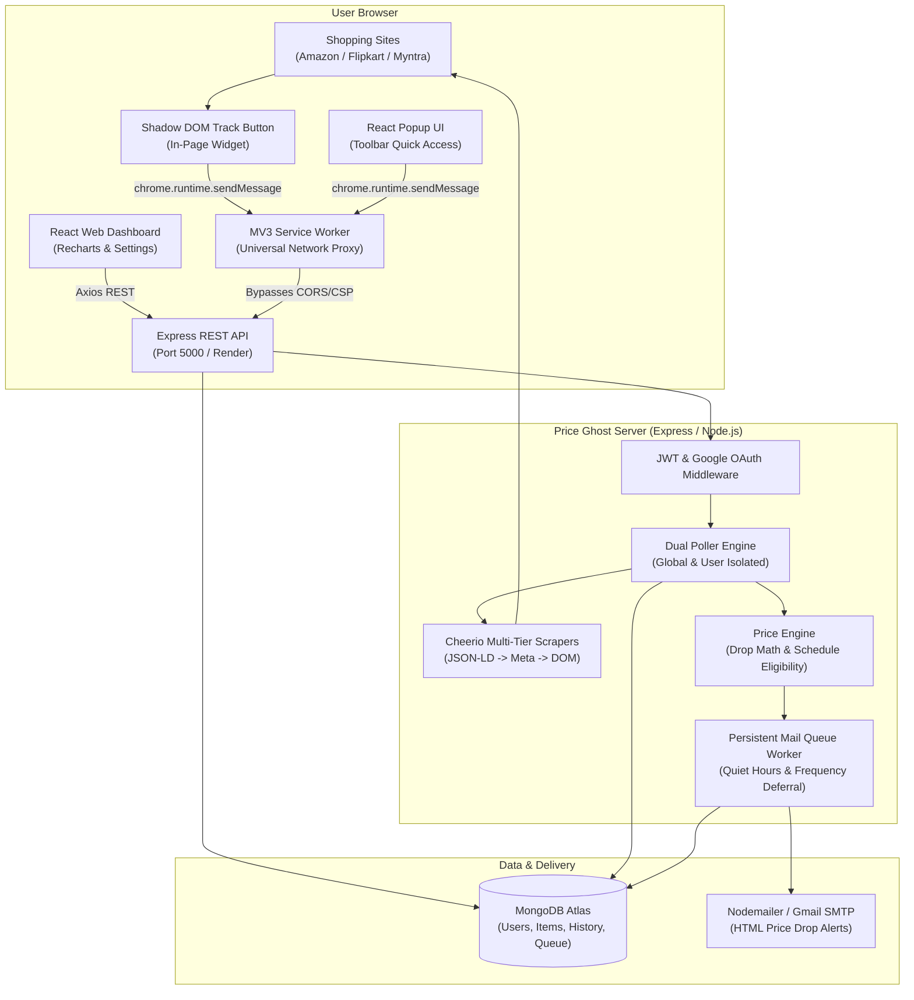

# 👻 Price Ghost

<div align="center">

> **Autonomous Multi-Platform E-Commerce Price Tracker & Intelligent Alert Engine**  
> Real-time price tracking on **Amazon**, **Flipkart**, and **Myntra** with zero-friction Chrome Extension discovery, scheduled scraping poller, persistent mail queues with quiet-hours batching, and interactive analytics.

[](https://github.com/MadhavaReddy-2807/Price_Ghost)
[](https://price-ghost.netlify.app)
[](https://price-ghost.onrender.com/api/health)
[](extension)
[](https://nodejs.org/)
[](https://react.dev/)
[](https://tailwindcss.com/)
[](https://www.mongodb.com/atlas)
[](LICENSE)

[Features](#-key-features) • [Architecture](#-architecture) • [Quick Start](#-quick-start) • [Extension Setup](#-loading-the-chrome-extension) • [Mail Queue Engine](#-mailing-queue--scheduling-engine) • [API Reference](#-api-reference) • [Testing](#-test-suites)

</div>

---

## 🌟 Overview

**Price Ghost** is a full-stack, pure JavaScript monorepo designed to eliminate price regret when shopping online. It pairs a **Manifest V3 Chrome Extension** for effortless in-page price tracking with an **autonomous background scraping engine** and a **persistent mailing queue system** that guarantees notifications are delivered when you want them—respecting quiet hours and batch schedules without dropping alerts.

### Supported Platforms
* 🛒 **Amazon India** (`amazon.in`)
* 📦 **Flipkart** (`flipkart.com`)
* 👗 **Myntra** (`myntra.com`)

---

## ✨ Key Features

### 🧩 Manifest V3 Chrome Extension
* **1-Click In-Page Tracking**: Injected floating "👻 Track Price" widget rendered inside an isolated **Shadow DOM** so it never clashes with host-page styles.
* **Universal Service Worker Proxy**: All network requests pass through the Manifest V3 background service worker using extension `host_permissions`, completely eliminating host-page **CORS** and **Content Security Policy (CSP)** restrictions.
* **Multi-Tier Endpoint Failover**: Automatically negotiates backend reachability across user-configured API URL $\to$ Production Render API $\to$ Netlify proxy $\to$ Localhost.
* **Dynamic Web Bridge**: Seamlessly synchronizes auth tokens and API configurations between the web dashboard and extension.
* **SPA Route Observer**: Tracks client-side navigation on Flipkart and Myntra using `history.pushState` patching and `MutationObserver`.
* **Toolbar Popup UI**: Built with React and Tailwind CSS. Features live title search, store filter tabs, price drop tags, inline threshold controls, and direct store links.

### 🧠 Autonomous Poller & Multi-Tier Scraper
* **Dual Poller Modes**:
  * **Global Catalog Poller**: Periodic sweeps across all tracked items with polite 2.5s pacing, User-Agent rotation, and jitter to avoid anti-bot blocks.
  * **User-Isolated Poller**: Instant on-demand check for a specific user's tracked items without locking the global engine.
* **3-Tier Resilient Extraction**:
  1. Semantic `application/ld+json` Schema Extraction.
  2. OpenGraph / Twitter Cards metadata.
  3. High-precision DOM fallback selectors.
* **Price History & Metrics**: Tracks all-time lowest, highest, MRP, deal price, and 365-day price history records.

### 📬 Smart Mailing Queue & Quiet-Hours Engine
* **Zero-Drop Alert Persistence**: Price drops occurring during quiet hours or cooldowns are saved in MongoDB as `pending` jobs—never discarded.
* **Quiet-Hours Window**: Suppresses notifications during user-defined sleep hours (e.g. `22:00` - `08:00`), including midnight-crossing intervals.
* **Custom Batch Frequency**: Supports `realtime`, `6h`, `12h`, and `24h` digest intervals with elapsed time tracking.
* **On-Demand Flush**: Manual triggers from user dashboard or admin control center bypass schedules via `{ force: true }`.
* **Granular Observability**: Dedicated logging for queue inspection, empty states, processing sweeps, and delivery outcomes.

### 🛡️ Admin Portal & Access Control
* **Role-Based Access**: Role hierarchy (`admin` vs `user`), access request approval flow, and custom item-tracking limits.
* **Real-Time Poller Controls**: Start/stop global poller, tune polling frequencies, trigger immediate cycles, and inspect live scraper statistics.
* **Mail Queue Manager**: Inspect global queue counts, tune background worker sweep frequency, and execute emergency flushes.

### 🩺 Health & Observability
* **Liveness & Readiness**: `/api/health/live`, `/api/health/ready`, and lightweight `/ping`.
* **Deep Upstream Inspection**: `/api/health/upstream` probes MongoDB latency, scraper reachability, SMTP transport, and process memory.

---

## 🏗️ Architecture



---

## 📁 Repository Structure

```
Price_Ghost/
├── server/                      # Express.js REST API & Poller Engine
│   ├── src/
│   │   ├── config/              # MongoDB connection & ENV configuration
│   │   ├── middleware/          # JWT auth & role-based access control
│   │   ├── models/              # Mongoose schemas (ItemModel, UserModel, SystemSetting)
│   │   ├── routes/              # Express API routers (auth, items, user, admin, poller)
│   │   ├── services/            # Poller engine, email service, mail queue, scrapers
│   │   │   └── scraper/         # Amazon, Flipkart, and Myntra extractors
│   │   ├── scripts/             # Seeding, diagnostic tools, and verification suites
│   │   └── app.js               # Application bootstrap & health monitor routes
│   └── package.json
├── extension/                   # Chrome Extension (Manifest V3)
│   ├── src/
│   │   ├── background/          # Universal service worker proxy & API failover
│   │   ├── content/             # Shadow DOM floating button & SPA route bridge
│   │   ├── popup/               # React + Tailwind extension popup interface
│   │   └── utils/               # Storage and messaging helpers
│   ├── manifest.json            # MV3 permission & host configuration
│   └── vite.config.ts
├── website/                     # React 18 Web Dashboard
│   ├── src/
│   │   ├── components/          # Navigation, PriceChart (Recharts), Product Cards
│   │   ├── context/             # AuthContext (Google OAuth & token storage)
│   │   ├── pages/               # Landing, Dashboard, Preferences, Admin, Install
│   │   └── services/            # API client with automatic token attachment
│   └── vite.config.ts
├── docker-compose.yml           # Production Docker container setup
├── package.json                 # Monorepo workspaces manifest
└── README.md                    # Project documentation
```

---

## ⚙️ Prerequisites

* **Node.js**: v18.x or v20.x LTS
* **npm**: v9.x or v10.x
* **MongoDB**: MongoDB Atlas URI or local instance (`mongodb://127.0.0.1:27017/price-tracker`)
* **Google Chrome**: For loading and testing the Chrome Extension

---

## 🚀 Quick Start

### 1. Clone & Install Dependencies
```bash
git clone https://github.com/MadhavaReddy-2807/Price_Ghost.git
cd Price_Ghost

# Install dependencies across all monorepo workspaces
npm install
```

### 2. Configure Environment Variables
Create or verify `server/.env`:
```env
PORT=5000
NODE_ENV=development
MONGODB_URI=mongodb+srv://<username>:<password>@cluster0.mongodb.net/price-tracker
JWT_SECRET=your_super_secret_jwt_key_here
CLIENT_URL=http://localhost:5173

# Optional: Email Notifications (Gmail App Password or SMTP provider)
SMTP_HOST=smtp.gmail.com
SMTP_PORT=587
SMTP_USER=your-email@gmail.com
SMTP_PASS=your-16-char-app-password
```

### 3. Launch the Backend Server
```bash
npm run dev:server
```
*API available at `http://localhost:5000` (Health check: `http://localhost:5000/api/health`).*

### 4. Launch the Web Dashboard
In a separate terminal:
```bash
npm run dev:website
```
*Web dashboard available at `http://localhost:5173`.*

---

## 🧩 Loading the Chrome Extension

### Build the Extension
```bash
npm run build:extension
```
This compiles the extension into `extension/dist/`.

### Load into Google Chrome
1. Open Chrome and navigate to `chrome://extensions/`.
2. Toggle on **Developer mode** in the top-right corner.
3. Click **Load unpacked** in the top-left corner.
4. Select the directory:
   * Select `extension/dist` (production bundle) or the root `extension` folder.
5. Pin **Price Ghost** to your browser toolbar.
6. Visit any product page on [Amazon.in](https://www.amazon.in), [Flipkart](https://www.flipkart.com), or [Myntra](https://www.myntra.com). The floating "👻 Track Price" widget will appear seamlessly!

---

## 📬 Mailing Queue & Scheduling Engine

Price Ghost includes a bulletproof mailing queue designed to eliminate lost alerts:

```
[ Price Drop Detected ] ──> shouldNotifyUser (ignoreQuietHours: true)
                                      │
                                      ▼
                           [ Enqueue into User Mail Queue ] (status: 'pending')
                                      │
                         isUserEligibleForScheduledDelivery?
                                 /          \
                              YES            NO
                              /                \
                             ▼                  ▼
                   [ Send Alert Email ]   [ Defer in Queue ]
                   (status: 'sent')       (status: 'pending')
                                                │
                                    Quiet Hours End / Schedule Open / Force Flush
                                                │
                                                ▼
                                       [ Deliver Pending Alerts ]
```

### Schedule Modes
* **Realtime**: Delivers alerts immediately when detected (outside quiet hours).
* **6-Hour Digest**: Delivers a batch at most once every 6 hours.
* **12-Hour Digest**: Delivers a batch at most once every 12 hours.
* **24-Hour Digest**: Delivers a batch at most once every 24 hours.

### Quiet Hours
* Define sleep windows (e.g. `23:00` - `07:00`).
* Drops occurring during this window are queued as `pending` and deferred until morning.
* Manual triggers (**"Process Queue"** on the dashboard or **"Flush Queue"** on the Admin panel) immediately deliver all pending alerts with `force: true`.

---

## 📡 API Reference

### Authentication & User
| Method | Endpoint | Auth | Description |
|---|---|---|---|
| `POST` | `/api/auth/google` | Public | Sign in / register via Google OAuth ID token |
| `POST` | `/api/auth/dev-login` | Public | Instant developer login (development mode) |
| `GET` | `/api/auth/me` | Bearer JWT | Retrieve current authenticated user profile |
| `GET` | `/api/user/mail-queue` | Bearer JWT | Fetch user's email queue history & pending items |
| `POST` | `/api/user/mail-queue/process` | Bearer JWT | Manually flush & deliver pending user alerts |
| `POST` | `/api/user/mail-queue/retry` | Bearer JWT | Retry failed alerts in the user's queue |
| `POST` | `/api/user/unsubscribe` | Public | One-click instant email alert unsubscribe |

### Tracked Items
| Method | Endpoint | Auth | Description |
|---|---|---|---|
| `GET` | `/api/items/tracked` | Bearer JWT | Retrieve all items tracked by current user |
| `POST` | `/api/items/track` | Bearer JWT | Upsert canonical product and attach to user |
| `POST` | `/api/items/track-url` | Bearer JWT | Scrape and track product by direct store URL |
| `DELETE` | `/api/items/untrack/:id` | Bearer JWT | Remove item from tracking list |
| `PUT` | `/api/items/:id/threshold` | Bearer JWT | Update price drop percentage target (5%-50%) |
| `GET` | `/api/items/:id/history` | Bearer JWT | Get price history timestamp series for charts |

### Poller & Scraper
| Method | Endpoint | Auth | Description |
|---|---|---|---|
| `POST` | `/api/poller/check-user` | Bearer JWT | Immediate user-isolated check of tracked items |
| `GET` | `/api/poller/status` | Bearer JWT | Current poller status, metrics, and last run time |
| `POST` | `/api/poller/run` | Admin JWT | Trigger immediate global poller cycle |

### Health & Monitoring
| Method | Endpoint | Auth | Description |
|---|---|---|---|
| `GET` | `/api/health` | Public | Heartbeat & ping for uptime monitors |
| `GET` | `/api/health/upstream` | Public | Full upstream diagnostic (DB, Scrapers, SMTP) |
| `GET` | `/api/health/ready` | Public | Kubernetes/Cloud readiness probe (DB status) |
| `GET` | `/api/health/live` | Public | Process liveness probe |

---

## 🧪 Test Suites

Price Ghost includes comprehensive verification suites:

```bash
# 1. Price Engine & Scrapers Unit Tests
npm --workspace=server run test

# 2. Mail Queue Persistence & Deduplication Tests
npm --workspace=server run test:queue

# 3. Mailing Schedules, Quiet-Hours Deferral & Force Flush Tests
npm --workspace=server run test:schedule

# 4. Admin Access Control & Permission Tests
npm --workspace=server run test:admin

# 5. Health & Diagnostic Monitor Tests
npm --workspace=server run test:health
```

---

## 📦 Production Builds

```bash
# Build web application and copy output to dist/
npm run build

# Build Chrome Extension
npm run build:extension

# Build Web application standalone
npm run build:website
```

---

## 🐳 Docker Deployment

Run the complete stack with MongoDB container:

```bash
# Start all containers in detached mode
docker compose up -d --build

# Inspect logs
docker compose logs -f server

# Stop containers
docker compose down
```

---

## 📄 License

This project is licensed under the [MIT License](LICENSE).

<div align="center">
Made with ❤️ by <a href="https://github.com/MadhavaReddy-2807">Madhava Reddy</a>
</div>
